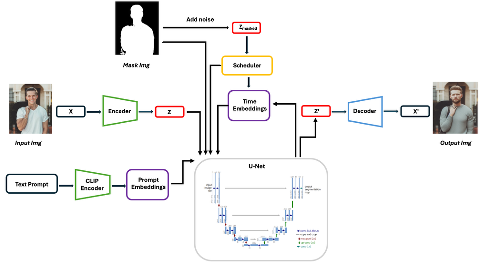
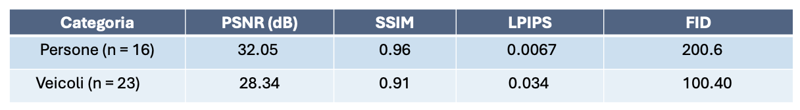
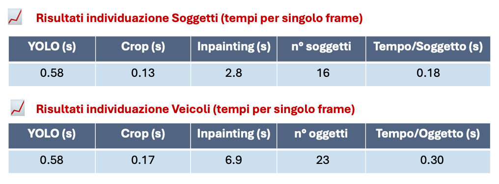

## Contesto

La crescente diffusione di sistemi di videosorveglianza, dispositivi mobili e strumenti di registrazione ha portato a un aumento esponenziale dei dati video generati quotidianamente. Tuttavia, questi contenuti spesso includono informazioni sensibili, come volti, targhe e altri elementi che possono violare la privacy degli individui.

In questo contesto, il progetto **`video_anonymization`** nasce con l’obiettivo di sviluppare un sistema automatico per l’anonimizzazione dei video, capace di identificare e oscurare in modo intelligente le aree sensibili all’interno delle immagini.

---

## 🎯 Obiettivo del progetto

L’obiettivo è stato quello di progettare e implementare un sistema automatizzato per l’anonimizzazione visiva di parti sensibili, come i volti di soggetti e le targhe di veicoli, nei flussi video urbani raccolti da telecamere di videosorveglianza stradale.

Tale sistema deve garantire la qualità visiva e tempi di latenza compatibili con l’elaborazione in tempo reale, nel rispetto delle normative europee in materia di privacy e intelligenza artificiale.

Il sistema quindi individua antonomasticamente i soggetti da anonimizzare e in base alla classe semantica rilevata genera una maschera binaria pixel-wise che delimita l’area da modificare e un prompt testuale specifico che descrive il contenuto da rigenerare.

---

## Architettura della pipeline di anonimizzazione

L’architettura del sistema proposto per l’anonimizzazione si basa su una pipeline modulare progettata per operare su flussi video sfruttando i principi del modello di Diffusione generativo.

Il processo ha inizio con il blocco di **encoding**, in cui l’immagine originale `X` di input viene convertita in uno **spazio latente compresso `Z`** tramite un **autoencoder convoluzionale**. In particolare è stato utilizzato un **variational autoencoder** composto da una serie di convoluzioni, *attention block* e *residual block*, progettati per ridurre progressivamente la risoluzione spaziale dell’immagine e aumentare la profondità semantica.

In parallelo, oltre al VAE, è presente un **text encoder basato su CLIP**, che elabora il prompt testuale fornito in input e genera le corrispondenti *prompt embeddings*, che guideranno la generazione del contenuto sostitutivo.

Nel contesto dell’**inpainting**, viene impiegata una **maschera binaria** per definire con precisione le aree dell’immagine da anonimizzare. Questa maschera viene applicata sull’immagine di input per poi essere trasformata nello spazio latente `Z_masked`, aggiungendo **rumore gaussiano**.

Tale latente degradato viene poi passato allo **scheduler**, responsabile della schedulazione temporale del processo di *denoising*. Esso gestisce i passaggi di rimozione progressiva del rumore durante la fase di generazione.

Successivamente, viene coinvolto il **blocco di time embedding**, che integra le informazioni temporali `t` all’interno del processo generativo.

Il cuore del sistema è rappresentato dal modulo **U-Net**, che riceve come input: il latente degradato `Z_masked`, la maschera binaria, le *prompt embeddings* e le informazioni temporali. L’U-Net genera una sequenza di feature che verranno poi utilizzate per ricostruire l’immagine anonimizzata nello spazio visivo.

---

## 📊 Analisi delle metriche

Per quanto riguarda la valutazione del sistema, ho condotto una serie di test quantitativi. I risultati ottenuti sono riportati nella tabella.

Le metriche utilizzate sono PSNR e SSIM, che misurano la fedeltà visiva e strutturale rispetto all’originale, LPIPS che valuta la similarità percepita, e FID utilizzata per analizzare quanto la distribuzione delle feature generate fosse simile a quella reale.

Per la categoria Persone, i valori di PSNR e SSIM sono bassi, e LPIPS è basso: questo indica che le immagini rigenerate sono coerenti e realistiche. Il valore FID è invece elevato, ma in questo contesto è positivo: significa che l’identità visiva è stata modificata in modo significativo, come richiesto per l’anonimizzazione.

Per i veicoli i valori sono più contenuti, ma il FID è più basso: segno che il sistema ha rigenerato in modo efficace senza alterazioni drastiche, dato che i veicoli richiedono un’alterazione meno invasiva.

In sintesi, le metriche confermano che il sistema garantisce un buon equilibrio tra qualità visiva e anonimizzazione efficace.

---

## Performance
 
L’obiettivo è stato quello di capire se il sistema può operare efficacemente in contesti real-time, come la videosorveglianza urbana.  
Per farlo, sono state implementate varie ottimizzazioni: in primo luogo, tutta l’inferenza è stata eseguita in precisione FP16, che consente di dimezzare il carico computazionale senza compromettere la qualità.  

Sono state inoltre testate diverse configurazioni hardware, tra cui GPU di fascia media e alta.  
Il tempo medio di elaborazione per frame è risultato compatibile con requisiti di near real-time, soprattutto grazie alla parallelizzazione dei processi di encoding e inpainting.  
È stata inoltre ridotta la latenza introducendo un sistema di prefetching e ottimizzazione della gestione delle maschere.  

In conclusione, l’architettura proposta riesce a bilanciare efficacemente qualità dell’anonimizzazione e tempi di esecuzione, risultando adatta a scenari operativi reali.

---

## 📁 Download necessari

### 📥 Tokenizer

Scarica i seguenti file da Hugging Face e salvali nella cartella `data/`:

- [`vocab.json`](https://huggingface.co/stable-diffusion-v1-5/stable-diffusion-v1-5/resolve/main/tokenizer/vocab.json)
- [`merges.txt`](https://huggingface.co/stable-diffusion-v1-5/stable-diffusion-v1-5/resolve/main/tokenizer/merges.txt)

> 📌 URL di origine: [https://huggingface.co/stable-diffusion-v1-5/stable-diffusion-v1-5/tree/main/tokenizer](https://huggingface.co/stable-diffusion-v1-5/stable-diffusion-v1-5/tree/main/tokenizer)

---

### 📥 Stable Diffusion Weights

Scarica il checkpoint principale da:

- [`v1-5-pruned-emaonly.ckpt`](https://huggingface.co/stable-diffusion-v1-5/stable-diffusion-v1-5/resolve/main/v1-5-pruned-emaonly.ckpt)

Salvalo nella cartella `data/`.

> 📌 URL di origine: [https://huggingface.co/stable-diffusion-v1-5/stable-diffusion-v1-5/tree/main](https://huggingface.co/stable-diffusion-v1-5/stable-diffusion-v1-5/tree/main)

---

### ✅ Modelli fine-tuned testati

Puoi anche utilizzare modelli fine-tuned basati su Stable Diffusion v1.5. Ad esempio:

- [`v1-5-pruned-emaonly-fp16.safetensors`](https://huggingface.co/Comfy-Org/stable-diffusion-v1-5-archive/resolve/main/v1-5-pruned-emaonly-fp16.safetensors)

Salvalo nella cartella `data/`.

> 📌 URL di origine: [https://huggingface.co/Comfy-Org/stable-diffusion-v1-5-archive/blob/main/v1-5-pruned-emaonly-fp16.safetensors](https://huggingface.co/Comfy-Org/stable-diffusion-v1-5-archive/blob/main/v1-5-pruned-emaonly-fp16.safetensors)

---

## 📦 YOLOv8-seg (Segmentazione)

Per usare la segmentazione, è necessario scaricare YOLOv8 con supporto a segmentazione (`yolov8-seg`)
